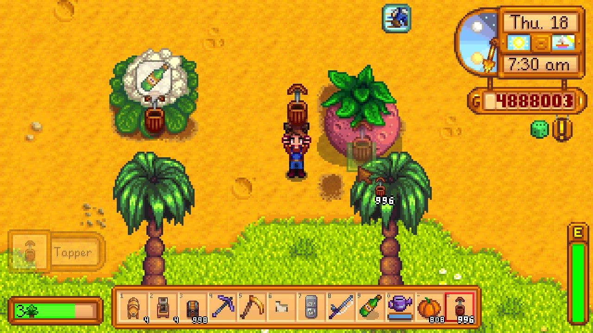

**You're viewing a file in the SMAPI mod dump, which contains a copy of every open-source SMAPI mod
for queries and analysis.**

**This is _not_ the original file, and not necessarily the latest version.**  
**Source repository: https://github.com/atravita-mods/StardewMods**

----

Tap Giant Crops.
=================================

Allows you to tap giant crops.

The tapper should produce the keg output for whatever crop the giant crop corresponds to.

## Install

1. Install the latest version of [SMAPI](https://smapi.io).
2. Download and install [AtraCore](https://www.nexusmods.com/stardewvalley/mods/12932).
2. Download this mod and unzip it into `Stardew Valley/Mods`.
3. Run the game using SMAPI.

## Compatibility

* Works with Stardew Valley 1.5.6 on Linux/macOS/Windows.
* Works in single player, multiplayer, and split-screen mode.
* Should be compatible with most other mods, including giant crops from [More Giant Crops](https://www.nexusmods.com/stardewvalley/mods/5263) and [Json Assets](https://www.nexusmods.com/stardewvalley/mods/1720). [DynamicGameAssets](https://www.nexusmods.com/stardewvalley/mods/9365?tab=description) giant crops are not yet supported.
* Doesn't work with Automate yet. Working on that!
* Doesn't work with all giant crops spawned by FTM yet!

A note: the tappers are refilled at night, so mods with tooltips (like UI Info Suite) will show them as empty after collection.

## See also

* [Changelog](docs/Changelog.md)
