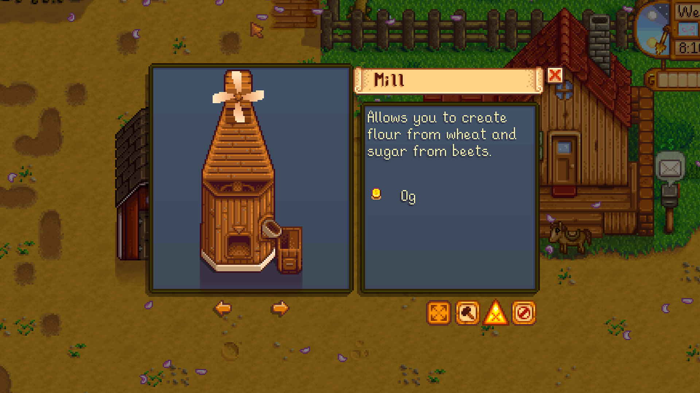
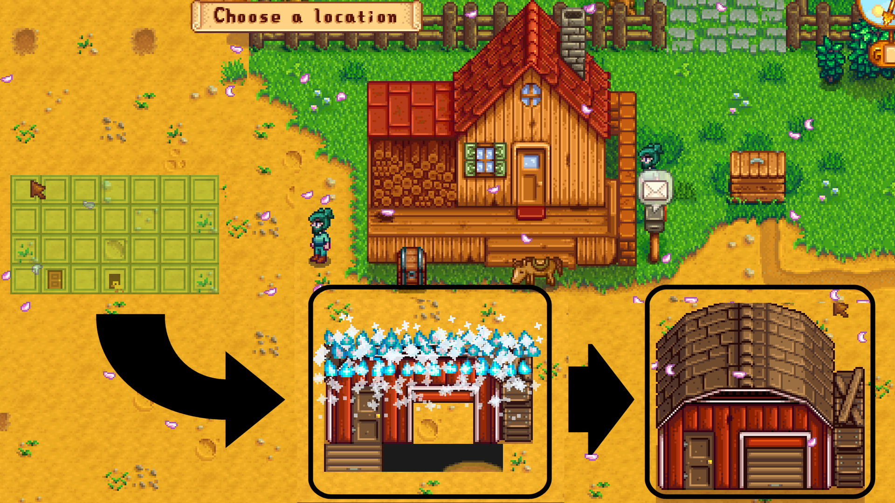
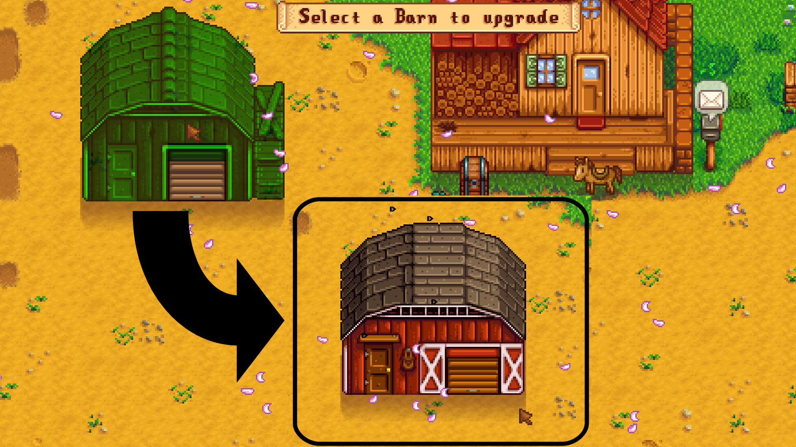
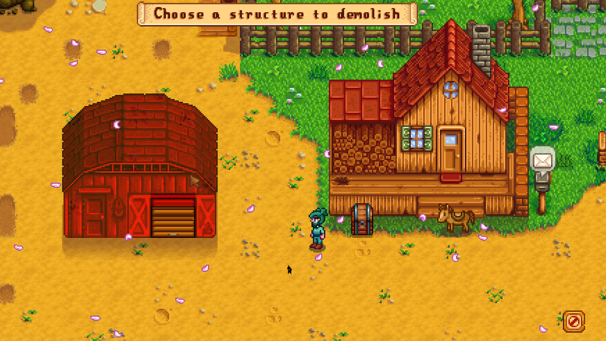

**You're viewing a file in the SMAPI mod dump, which contains a copy of every open-source SMAPI mod
for queries and analysis.**

**This is _not_ the original file, and not necessarily the latest version.**  
**Source repository: https://github.com/bitwisejon/StardewValleyMods**

----

**Instant Buildings from Farm** is a [Stardew Valley](http://stardewvalley.net/) v1.5 mod which lets you build any building normally sold by the 
carpenter directly from your farm without waiting for days for Robin to build them. Buildings are created/upgraded instantly, and the magician 
buildings are included too! You can also upgrade your house or cabin instantly to add the kitchen, nursery, and cellar directly from your farm
without having to wait. The configuration file allows you to turn off the resource requirements needed to build/upgrade so you can play around in 
a sandbox mode if you want.

**Note**: There is a known issue with a brand new player upgrading their house or cabin through all levels which causes the game to crash when entering
the cellar on the same day. The workaround is to go to sleep first after the cellar upgrade is complete and then you may enter the cellar after that
without it crashing.

## Contents
* [Install](#install)
* [Use](#use)
* [Buildings](#buildings)
* [Configuration](#configuration)
* [Mod Compatibility](#mod-compatibility)
* [Versions](#versions)
* [See also](#see-also)

## Install
1. [Install the latest version of SMAPI](https://smapi.io/).
2. Install [this mod from Nexus mods](http://www.nexusmods.com/stardewvalley/mods/2070).
3. Run the game using SMAPI.

## Use
Press the 'B' key (configurable) to open the building catalogue anywhere on your farm:
> 

Select a building to build and watch it happen instantly:
> 

Upgrades happen instantly too:
> 

You can also move and destroy buildings directly from your farm:
> 

Press the 'U' key (configurable) to upgrade your house or cabin to the next level.

## Buildings
All of the following buildings can be built instantly from the catalogue menu on your farm:
* Coop
* Barn
* Well
* Silo
* Mill
* Shed
* Cabins (for multiplayer)
* Stable (the horse will appear the next day)
* Tractor Garage (requires TractorMod and tractor will appear the next day)
* Slime Hutch
* Junimo Hut
* Earth Obelisk
* Water Obelisk
* Island Obelisk
* Gold Clock

The following buildings can be upgraded instantly provided you already have the required building:
* Big Coop (requires Coop)
* Deluxe Coop (requires Big Coop)
* Big Barn (requires Barn)
* Deluxe Barn (requires Big Barn)

In multiplayer, any player can use the build menu and the new building will appear instantly for all players.

## House/Cabin Upgrades
Pressing the 'U' key prompts Robin to ask if the player wants to upgrade their house or cabin to the next available level. Clicking 'Yes' will instantly
upgrade the house/cabin to that upgrade level and change the appearance of the building. The player can immediately hit 'U' again to continue upgrading.

In multiplayer, any player can use the house/cabin upgrade feature and the new building will appear instantly for all players.

## Configuration
This mod creates a config.json file the first time you run it. Once created, open the file in a text editor to configure the mod. You can set the following options:

setting | default | effect
:------ | :------ | :-----
`BuildUsesResources` | `true` | Set to false to enable sandbox mode. Buildings will cost no gold or resources.
`AllowMagicalBuildingsWithoutMagicInk` | `false` | If false, will only allow the Magician buildings to be built once the player has the magic ink. Set to true for "sandbox" mode.
`ToggleInstantBuildMenuButton` | `B` | Change this value to bind the Instant Build menu to another key.
`PerformInstantHouseUpgradeButton` | `U` | Change this value to bind the Instant House/Cabin Upgrade feature to another key.

## Mod Compatibility
**Note:*** This mod is only compatible with version 1.5 of Stardew Valley (released 12/21/2020) and works in multiplayer as well. 

This mod is fully compatible with:
* [TractorMod](http://www.nexusmods.com/stardewvalley/mods/1401) by Pathoschild. The Tractor Garage will appear in the build menu if the mod is installed.
* [One Click Shed Reloader](http://www.nexusmods.com/stardewvalley/mods/2052) by me.

## Versions
See [release notes](release-notes.md).

## See also
* [Nexus mod](http://www.nexusmods.com/stardewvalley/mods/2070)

