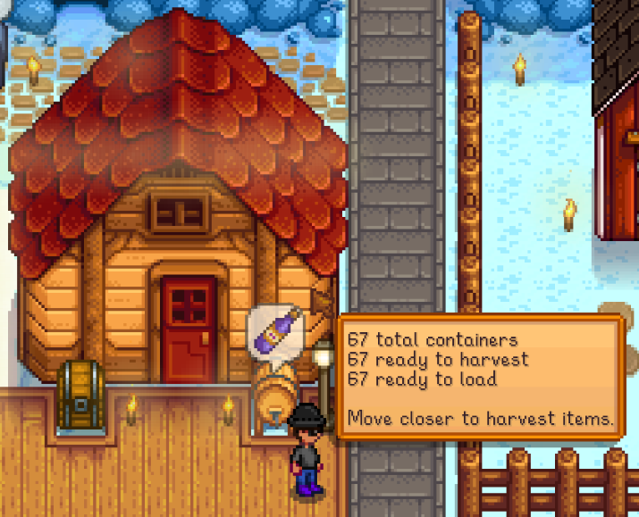
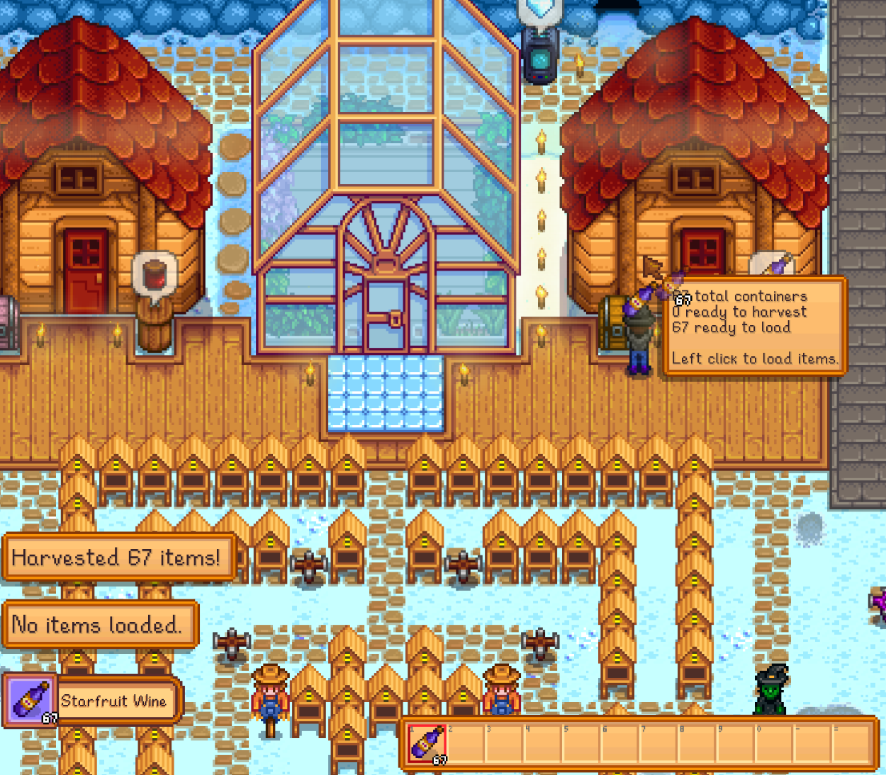
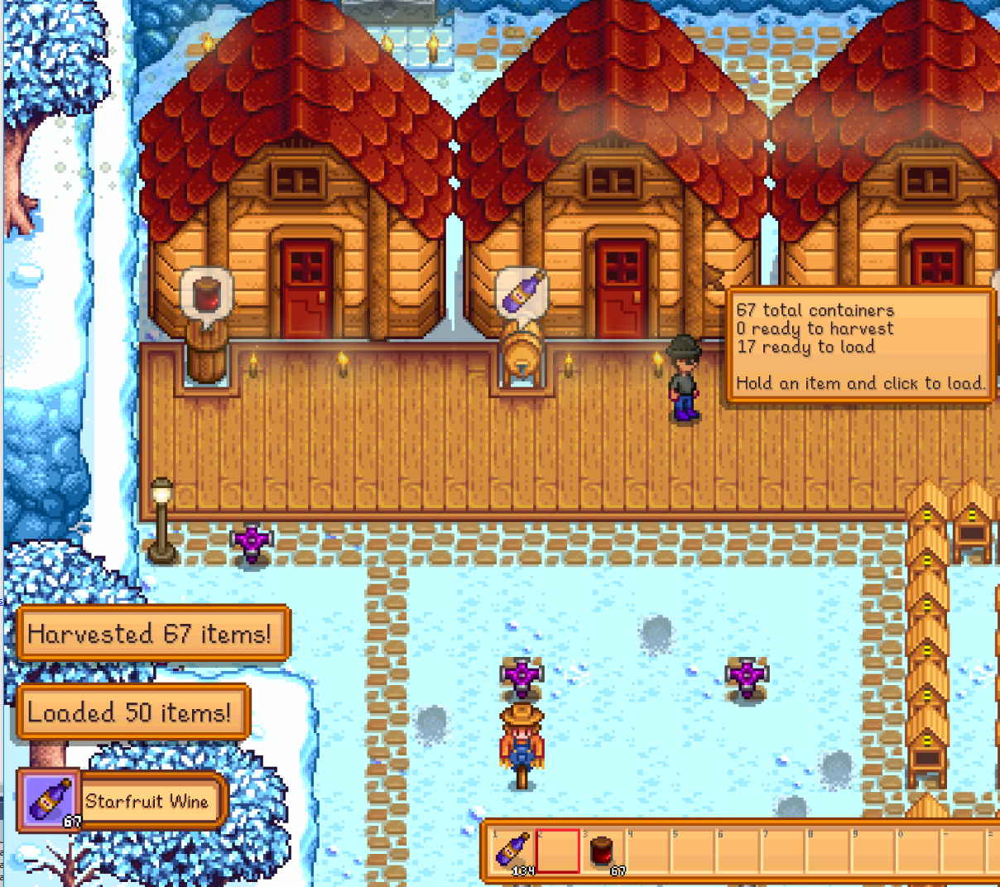
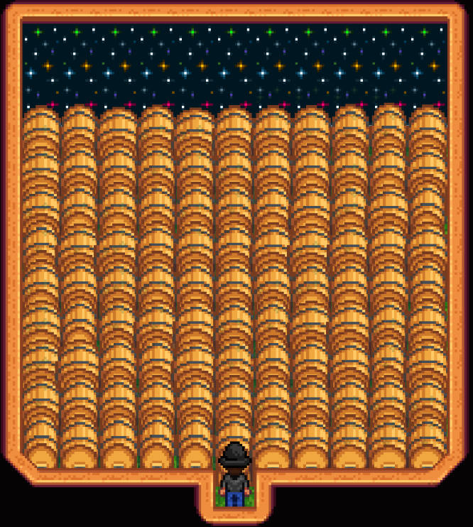

**You're viewing a file in the SMAPI mod dump, which contains a copy of every open-source SMAPI mod
for queries and analysis.**

**This is _not_ the original file, and not necessarily the latest version.**  
**Source repository: https://github.com/bitwisejon/StardewValleyMods**

----

**One Click Shed Reloader** is a [Stardew Valley](http://stardewvalley.net/) v1.6 mod which lets you harvest and reload
all supported containers in a Shed, Barn, Coop, Cellar, Cave, or Greenhouse with a single click on the outside of the building. Only the
house's/cabin's owner can harvest/reload the cellar in multiplayer. Harvesting/reloading the house/cabin itself is NOT supported by this mod.

**Important Note**: In multiplayer, farmhands can only harvest/reload the Cave and their Cellar from within that location due to a limitation 
of SMAPI and the fact that these locations are not synced with the main game unless a player is in the location. To harvest/reload as a 
farmhand in these locations, hover the cursor around the entryway once inside.

## Contents
* [Install](#install)
* [Use](#use)
* [Supported Buildings](#supported-buildings)
* [Supported Containers](#supported-containers)
* [Support for Other Mods](#support-for-other-mods)
* [Notes](#Notes)
* [Mod Compatibility](#mod-compatibility)
* [Versions](#versions)
* [See also](#see-also)

## Install
1. [Install the latest version of SMAPI](https://smapi.io/).
2. Install [this mod from Nexus mods](http://www.nexusmods.com/stardewvalley/mods/2052).
3. Run the game using SMAPI.

## Use
Hover the cursor over a supported building (or entryway from inside the location) to get instant info about the containers in the building that 
are ready to harvest and reload:
> 

Move closer to the building and left-click the outside to harvest all ready containers within:
> 

If you are holding an item that can be loaded into an empty container within the building, it will be loaded automatically
when left-clicking the building.  This can be done at the same time as harvesting which makes managing buildings full of
containers much easier!
> 

This mod allows you to take full advantage of all available space within a location since there is never a need to enter it again!
> 

## Supported Buildings
The following buildings are currently supported.
* Shed
* Barn (any size)
* Coop (any size)
* Cellar (in the main house or a cabin - only the home owner can do this!)
* Cave
* Greenhouse

## Supported Containers
The following containers are currently supported. 
* Auto-Grabber
* Bee House
* Cask
* Charcoal Kiln
* Cheese Press
* Crystalarium
* Furnace
* Keg
* Loom
* Mayonnaise Machine
* Mushroom Box
* Oil Maker
* Preserves Jar
* Recycling Machine
* Statue Of Endless Fortune
* Statue Of Perfection

## Support for Other Mods
While I do not officially support any other mods except my own, I have added the ability for you to support any mods you like by modifying the config file
that is created after running Stardew Valley the first time after installing this mod. Launch Stardew Valley one time and then exit. Then open the config.json
file in the `Stardew Valley\Mods\OneClickShedReloader` directory. See instructions in that file for how to discover and add new items.

## Notes
This mod does not affect your save game files in any way. Due to the required mouse events, this mod likely only works on PC. Other platforms are not officially supported. 
There are no known compatibility issues with this mod, but there could be problems with any mod that displays information while hovering the cursor 
over a building, or with mods that handle click events on buildings. If you discover any problems while using the mod, you can log an issue on 
the [BitwiseJon GitHub page](https://github.com/bitwisejon/StardewValleyMods/issues). Only U.S. English text is provided at this time.

## Mod Compatibility
**Note:*** This mod is only compatible with version 1.6 of Stardew Valley (released 3/19/2024) and works in multiplayer as well.  

This mod is fully compatible with:
* [Instant Buildings from Farm](http://www.nexusmods.com/stardewvalley/mods/2070) by me.

## Versions
See [release notes](release-notes.md).

## See also
* [Nexus mod](http://www.nexusmods.com/stardewvalley/mods/2052)
