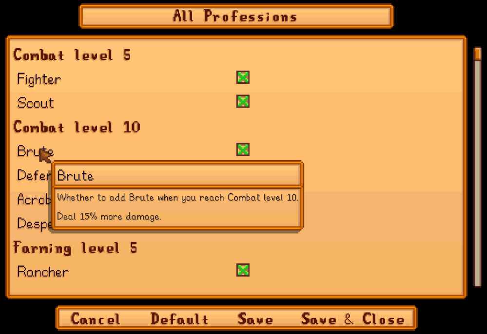

**You're viewing a file in the SMAPI mod dump, which contains a copy of every open-source SMAPI mod
for queries and analysis.**

**This is _not_ the original file, and not necessarily the latest version.**  
**Source repository: https://github.com/cantorsdust/StardewMods**

----

**All Professions** is a [Stardew Valley](http://stardewvalley.net/) mod which gives your farmer
all possible professions when you level up, instead of just the one chosen.

## Contents
* [Install](#install)
* [Use](#use)
* [Configure](#configure)
* [Compatibility](#compatibility)
* [See also](#see-also)

## Install
1. [Install the latest version of SMAPI](https://smapi.io).
2. Install [this mod from Nexus mods](https://www.nexusmods.com/stardewvalley/mods/174).
3. Run the game using SMAPI.

## Use
Just install the mod and play the game. When you level up, all professions will be added to your
farmer instead of just your chosen one (e.g. both Rancher and Tiller instead of just Rancher). If
your farmer already leveled up, any profession they're eligible for will be added automatically.

## Configure
### In-game settings
If you have [Generic Mod Config Menu](https://www.nexusmods.com/stardewvalley/mods/5098) installed,
you can click the cog button (⚙) on the title screen or the "mod options" button at the bottom of
the in-game menu to configure the mod. Hover the cursor over a field for details, or see the next
section.

This doesn't affect professions that have already been unlocked for a save.



### `config.json` file
The mod creates a `config.json` file the first time you run it. You can open the file in a text
editor to configure the mod:

<table>
<tr>
<th>setting</th>
<th>effect</th>
</tr>

<tr>
<td><code>IgnoreProfessions</code></td>
<td>

The professions which shouldn't be added automatically. You can specify profession codes (as listed
in the `assets/data.json` file) or internal profession IDs (like `9` for the pirate profession).
This doesn't affect professions that have already been unlocked for a save.

For example:

```js
{
    "IgnoreProfessions": [ "Mariner", "Tracker" ]
}
```

</td>
</tr>
</table>

## Profession mapping
The `assets/data.json` file defines which professions get assigned for each skill level. You can
open the file in a text editor to customize them, e.g. to add custom professions if you know their
internal numeric ID. Note that this file will be reset when you update, so you'll need to reapply
your changes each time.

## Compatibility
* Works with Stardew Valley 1.5.5+ on Linux/Mac/Windows.
* Works in single-player, multiplayer, and split-screen mode.
* No known mod conflicts.

## See also
* [Release notes](release-notes.md)
* [Nexus mod](https://www.nexusmods.com/stardewvalley/mods/174)
