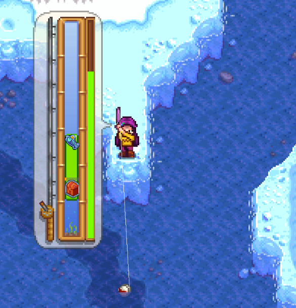
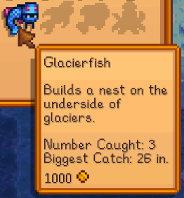
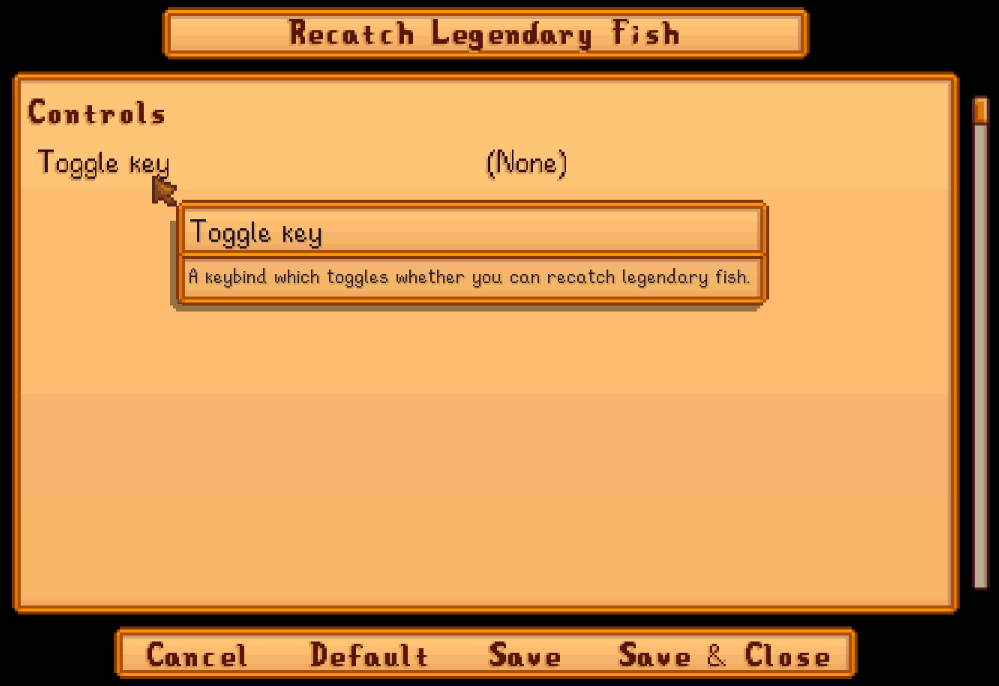

**You're viewing a file in the SMAPI mod dump, which contains a copy of every open-source SMAPI mod
for queries and analysis.**

**This is _not_ the original file, and not necessarily the latest version.**  
**Source repository: https://github.com/cantorsdust/StardewMods**

----

**Recatch Legendary Fish** is a [Stardew Valley](http://stardewvalley.net/) mod which lets you
catch legendary fish again and again.

## Contents
* [Install](#install)
* [Use](#use)
* [Configure](#configure)
* [Compatibility](#compatibility)
* [See also](#see-also)

## Install
1. [Install the latest version of SMAPI](https://smapi.io).
2. Install [this mod from Nexus mods](https://www.nexusmods.com/stardewvalley/mods/172).
3. Run the game using SMAPI.

## Use
Just install the mod and play the game. You'll be able to catch the legendary fish repeatedly.

## Configure
### In-game settings
If you have [Generic Mod Config Menu](https://www.nexusmods.com/stardewvalley/mods/5098) installed,
you can click the cog button (⚙) on the title screen or the "mod options" button at the bottom of
the in-game menu to configure the mod. Hover the cursor over a field for details, or see the next
section.

### `config.json` file
The mod creates a `config.json` file the first time you run it. You can open the file in a text
editor to configure the mod:

setting | effect
:------ | :-----
`ToggleKey` | A [keybind](https://stardewvalleywiki.com/Modding:Player_Guide/Key_Bindings) that toggles whether you can recatch legendary fish in-game. There's no keybind by default.

## Compatibility
* Works with Stardew Valley 1.6+ on Linux/macOS/Windows.
* Works in single-player, multiplayer, and split-screen mode.
* No known mod conflicts.

## See also
* [Release notes](release-notes.md)
* [Nexus mod](https://www.nexusmods.com/stardewvalley/mods/172)
