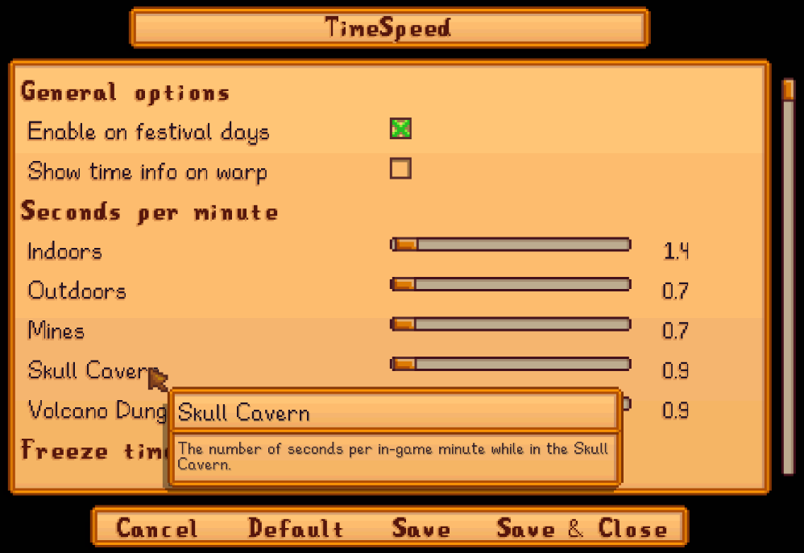

**You're viewing a file in the SMAPI mod dump, which contains a copy of every open-source SMAPI mod
for queries and analysis.**

**This is _not_ the original file, and not necessarily the latest version.**  
**Source repository: https://github.com/cantorsdust/StardewMods**

----

**TimeSpeed** is a [Stardew Valley](http://stardewvalley.net/) mod which lets you control the flow
of time in the game: speed it up, slow it down, or freeze it altogether. This can happen
automatically or when you press a key in the game.

## Contents
* [Install](#install)
* [Use](#use)
* [Configure](#configure)
* [Compatibility](#compatibility)
* [See also](#see-also)

## Install
1. [Install the latest version of SMAPI](https://smapi.io).
2. Install [this mod from Nexus mods](https://www.nexusmods.com/stardewvalley/mods/169).
3. Run the game using SMAPI.

## Use
You can press these keys in-game (configurable):

key | effect
:-- | :-----
`N` | Freeze or unfreeze time. Freezing time will stay in effect until you unfreeze it; unfreezing time will stay in effect until you enter a new location with time settings.
`,` | Speed up time by one second per 10-game-minutes. Combine with Control to decrease by 100 seconds, Shift to decrease by 10 seconds, or Alt to decrease by 0.1 seconds.
`.` | Slow down time by one second per 10-game-minutes. Combine with `Control` to increase by 100 seconds, `Shift` to increase by 10 seconds, or `Alt` to increase by 0.1 seconds.
`B` | Reload the config settings from file.

## Configure
### In-game settings
If you have [Generic Mod Config Menu](https://www.nexusmods.com/stardewvalley/mods/5098) installed,
you can click the cog button (⚙) on the title screen or the "mod options" button at the bottom of
the in-game menu to configure the mod. Hover the cursor over a field for details, or see the next
section.



### `config.json` file
The mod creates a `config.json` file the first time you run it. You can open the file in a text
editor to configure the mod:

<table>
<tr>
<th>setting</th>
<th>effect</th>
</tr>

<tr>
<td><code>EnableOnFestivalDays</code></td>
<td>

Whether to change tick length on festival days. Default true.

</td>
</tr>

<tr>
<td><code>LocationNotify</code></td>
<td>

Whether to show a message about the time settings when you enter a location. Default false.

</td>
</tr>

<tr>
<td><code>SecondsPerMinute</code></td>
<td>

How time passes in-game, measured in seconds per in-game minute. This is configured per location
type, but you can set them all to the same value if you want.

For each location, the first match is applied in this order:

1. `ByLocationName`: the time speed by internal location name (as shown by [Debug Mode](https://www.nexusmods.com/stardewvalley/mods/679)).
   For the [Deep Woods](https://www.nexusmods.com/stardewvalley/mods/2571) mod, you can use
   `DeepWoods` as the location name.

   For example, this sets the time speed in the farmhouse and farm:

   ```js
   "ByLocationName": {
       "FarmHouse": 2.0,
       "Farm": 0.9
   }
   ```

2. The [`Mines`](https://stardewvalleywiki.com/The_Mines), [`SkullCavern`](https://stardewvalleywiki.com/Skull_Cavern),
   and [`VolcanoDungeon`](https://stardewvalleywiki.com/Volcano_Dungeon).
3. Else `Indoors` or `Outdoors`.

See [default times](https://stardewvalleywiki.com/Day_Cycle#Passage_of_time) on the wiki.

</td>
</tr>

<tr>
<td><code>FreezeTime</code></td>
<td>

Where and when to freeze time in-game.

For each location, the first match is applied in this order:

1. `AnywhereAtTime`. This is a time of day in the game's 26-hour time internally, from 600 (6am) to
   2600 (2am after midnight). Make sure the number doesn't start with a zero, due to a bug in the
   underlying parser. Defaults to `null` for disabled.
2. Else by location in the same order as `SecondsPerMinute` above.

</td>
</tr>

<tr>
<td><code>Keys</code></td>
<td>

The keyboard/controller/mouse bindings used to control the flow of time. See [available
keys](https://stardewvalleywiki.com/Modding:Key_bindings#Available_bindings). Set a key to `"None"`
(including the quotes) to disable it.

</td>
</tr>
</table>

## Compatibility
* Works with Stardew Valley 1.6+ on Linux/macOS/Windows.
* Works in single-player, multiplayer, and split-screen mode. In multiplayer you must be the main player. (The mod will disable itself if you're not the main player, so it's safe to keep installed.)
* No known mod conflicts.

## See also
* [Release notes](release-notes.md)
* [Nexus mod](https://www.nexusmods.com/stardewvalley/mods/169)
* [_Passage of time_ on the wiki](https://stardewvalleywiki.com/Day_Cycle#Passage_of_time) for the vanilla time speed info
