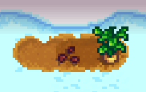

**You're viewing a file in the SMAPI mod dump, which contains a copy of every open-source SMAPI mod
for queries and analysis.**

**This is _not_ the original file, and not necessarily the latest version.**  
**Source repository: https://github.com/cantorsdust/StardewMods**

----

**All Crops All Seasons** is a [Stardew Valley](http://stardewvalley.net/) mod which lets you grow
crops in any season, including winter:
> 

## Contents
* [Install](#install)
* [Use](#use)
* [Compatibility](#compatibility)
* [See also](#see-also)

## Install
1. [Install the latest version of SMAPI](https://smapi.io).
2. Install [this mod from Nexus mods](https://www.nexusmods.com/stardewvalley/mods/170).
4. Run the game using SMAPI.

## Use
Just install the mod and play the game. You'll be able to plant and harvest crops in any season,
and your crops will be saved each night. This mod does _not_ change store inventories, so you can
only buy crop seeds during their usual seasons.

## Compatibility
* Works with Stardew Valley 1.3 on Linux/Mac/Windows.
* Works in single-player and multiplayer.
* No known mod conflicts.

## See also
* [Release notes](release-notes.md)
* [Nexus mod](https://www.nexusmods.com/stardewvalley/mods/170)
* [Discussion thread](https://community.playstarbound.com/threads/smapi-all-crops-all-seasons-plant-and-harvest-any-crop-in-any-season.108526/)
