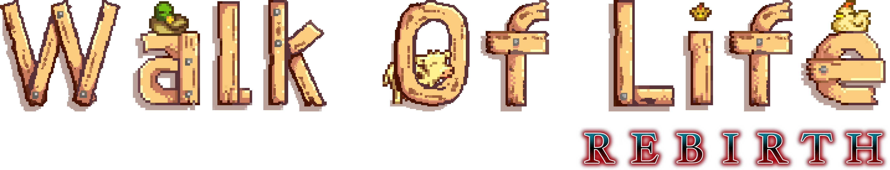
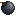
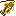
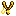

**You're viewing a file in the SMAPI mod dump, which contains a copy of every open-source SMAPI mod
for queries and analysis.**

**This is _not_ the original file, and not necessarily the latest version.**  
**Source repository: https://github.com/daleao/sdv**

----

 

<a id="top"/>
<!-- TABLE OF CONTENTS -->

Table of Contents

<ol>
	<li><a href="#what-this-is">What this is</a></li>
	<li>
		<a href="#the-professions">The Professions</a>
		<ol>
			<li><a href="#-farming">Farming</a></li>
			<li><a href="#-foraging">Foraging</a></li>
			<li><a href="#-mining">Mining</a></li>
			<li><a href="#-fishing">Fishing</a></li>
			<li><a href="#-combat">Combat</a></li>
		</ol>
	</li>
	<li>
		<a href="#skill-progression-tropes">Skill Progression Tropes</a>
		<ol>
			<li><a href="#profession-change-skill-reset">Profession Change Skill Reset</a></li>
			<li><a href="#prestige-professions">Prestige Professions</a></li>
			<li><a href="#limit-breaks">Limit Breaks</a></li>
		</ol>
	</li>
	<li><a href="#misc-changes">Misc. Changes</a></li>
	<li><a href="#compatibility">Compatibility</a></li>
    <li><a href="#credits--special-thanks">Credits & Special Thanks</a></li>
	<li><a href="#for-mod-authors">For Mod Authors</a></li>
	<li><a href="#faq">F.A.Q.</a></li>
</ol>

## What this is

This mod is an extensive overhaul of the skill progression and profession tree systems. It replaces the unbalanced and gold-centric vanilla professions with more unique and impactful choices that serve as pivotal anchors to reshape gameplay experiences.

Optionally, this mod also brings classic progression tropes like [Prestige Classes](https://tvtropes.org/pmwiki/pmwiki.php/Main/PrestigeClass), [Class Change Level Reset](https://tvtropes.org/pmwiki/pmwiki.php/Main/ClassChangeLevelReset), and [Limit Breaks](https://tvtropes.org/pmwiki/pmwiki.php/Main/LimitBreak).

This module was inspired by such great overhaul mods as [Enai Siaion][user:enai]'s [Ordinator][mod:ordinator] for Skyrim and [ReaperAnon](user:reaperanon)'s [Witcher 3 Enhanced Edition](mod:w3ee). It borrows many ideas and assets from the classic [Ragnarok Online][url:ragnarok], and also includes new improved profession icons by [IllogicalMoodSwing][user:illogicalmoodswing] (**please visit and endorse [Profession Icons Redone](mod:icons-redone)!**).

[🔼 Back to top](#top)

## The Professions

Click on any profession below to expand for more details. Golden professions refer to [Prestige Professions](#prestige-progression) variants.

###  Farming

<ul>

<!--- Harvester --->

 <b>Harvester (Lv5)</b> - 10% chance for extra yield from harvested crops.

<ul>

 <b>Master Harvester (Lv15)</b> - <s>10%</s> → 20% chance for extra yield from harvested crops.

Equivalent in value to vanilla's 10% price bonus on average, while also providing value should you choose not to sell raw crops.

</ul>

<!--- Agriculturist --->

 <b> Agriculturist (Lv10)</b> - Crops grow 10% faster. Can harvest best-quality crops organically without fertilizer.

<ul>

 <b>Cropwhisperer (Lv20)</b> - Crops grow <s>10%</s> → 20% faster and can survive the first day out-of-season.

Allows harvesting iridium-quality crops, normally only possible with Deluxe Fertilizer. Chance is equivalent to half of the chance with Deluxe Fertilizer, which means that **fertilizers are by no means obsolete**. Note that quality is determined only on the moment of harvest; planted crops have no quality, which means the perk will apply to crops planted before obtaining this profession.

</ul>

<!--- Artisan --->

 <b>Artisan (Lv10)</b> - Artisan machines work 10% faster. Machine output quality can be as good as input ingredient quality.

<ul>

 <b>Industrialist (Lv20)</b> - Hopper-automated machines work 25% faster. Machine output quality is always as good as input ingredient quality.

The quality of the output is based on your Farming level. The lowest possible quality is 2 stages below the input quality, and the highest is 1 stage above at a flat 5% chance. For reference, the chance to *match* input quality at Farming level 10 is 30%. Note that the quality preservation part of the perk is tied to the Artisan player, while the production time and quality promotion perks are tied to the machine itself; i.e., only Artisans themselves can preserve the ingredient quality, and they can do so on any machine, but non-Artisan players can still benefit from faster production and small chance for quality upgrade (in that case, capped at silver), so long as they use a machine that was crafted by an Artisan player (ownership requirements can be turned off in the configs).

In order to maintain the consistency of this profession, this mod also adds two additional optional changes: first, it makes Large Eggs and Large Milk yield double amounts of regular-quality Mayo and Cheese respectively, instead of increasing each to gold-quality, and second, it adds Ostrich and Golden Mayo items, replacing the weird vanilla rules that normally apply to Ostrich and Golden eggs. Blue Mayo is not included. Both options are enabled by default.

**Please be aware that Hopper behavior is improved by the core mod [Lionheart](../Core).**

</ul>

<!--- Rancher --->

 <b>Rancher (Lv5)</b> - Befriend animals 2x more quickly.

<ul>

 <b>Master Rancher (Lv15)</b> - Befriend animals <s>2×</s> → 3x more quickly.

Grants double mood *and* friendship points from petting. Newborn animals are born with a non-zero, randomized initial friendship.

</ul>

<!--- Breeder --->

 <b>Breeder (Lv10)</b> - Incubation 2x faster and natural pregnancy 3x more likely. Friendly animals are valued significantly higher.

<ul>

 <b>Progenitor (Lv20)</b> - Hatched or bred animals are always worth maximum value. Deluxe Barn capacity +2.

At max friendship animals are worth 10x their base price, compared to vanilla's 1.3x without this profession. Prestige eliminates the friendship requirement.

</ul>

<!--- Producer --->

 <b>Producer (Lv10)</b> - Happy animals produce 2x as frequently. Produce is worth 5% more for every full barn or coop.

<ul>

 <b>Yieldmeister (Lv20)</b> - Happy animals produce <s>2x</s> → 3x as frequently. Deluxe Coop capacity +2.

Note that happiness, or [mood](https://stardewvalleywiki.com/Animals#Mood), is **not** the same as friendship. This will **not** allow certain animals that already produce every day (i.e., cows and chickens) to produce more that once per day. The bonus produce value also applies to artisan goods derived from animal products (such as cheeses, mayos and cloth), honey (bees are animals too), and meats. Only deluxe buildings can be considered full, and only barns and coops owned by the Producer will be considered (ownership requirements can be turned off in the configs). There is no limit to the price bonus.

</ul>

</ul>

###  Foraging

<ul>

<!--- Forager --->

 <b>Forager (Lv5)</b> - 20% chance for double yield of foraged items.

<ul>

 <b>Master Forager (Lv15)</b> - <s>20%</s> → 40% chance for double yield of foraged items.

Other than the name, this profession is unchanged from vanilla.

</ul>

<!--- Ecologist --->

 <b>Ecologist (Lv10)</b> - Foraged items restore 50% more health and energy. The quality of foraged items increases as new varieties are uncovered.

<ul>

 <b>Bioharmonist (Lv20)</b> - Foraged items restore <s>50%</s> → 100% more health and energy and also afford buffs.

All foraged items will have the same deterministic quality, providing immediate inventory convenience. However, that quality will initially start out at silver, and gradually progress to iridium as you gather and study new varieties of forage. Unlike vanilla, this perk will also apply to hoed forage (such as Winter Root, Snow Yams and Ginger), Coconuts shaken off of palm trees, and mushrooms produced by Mushroom Boxes, but only if the cave owner (i.e., the host player) has the profession.

For Bioharmonist, a buff will be chosen at random the first time a forage is consumed after obtaining the profession. From that moment onwards, that particular forage will always afford the same buff, which will be indicated in the item's tooltip.

</ul>

<!--- Scavenger --->

 <b>Scavenger (Lv10)</b> - Location of forageable items revealed. Occasionally detect buried treasures.

<ul>

 <b>Relicseeker (Lv20)</b> - Time freezes during Scavenger Hunts. Find increasingly more forageables during a high Scavenger streak.

Whenever you are outside there is a chance to trigger a **Scavenger Hunt** minigame; find the hidden buried treasure by following the purple HUD arrows, and dig it up (with a hoe) before the time limit to obtain a reward. Rewards may start out underwheming, but can be improved dramatically by building up a streak. You also gain the ability to hold a mod key (LeftShift by default) to highlight all forageable items currently on-screen, for your convenience. Moreover, you can optionally configure the tracking HUD arrows to not be active all the time, and instead appear only when holding that same mod key.

</ul>

<!--- Lumberjack --->

 <b>Lumberjack (Lv5)</b> - Felled trees yield 25% more wood.

<ul>

 <b>Master Lumberjack (Lv15)</b> - Felled trees yield <s>25%</s> → 50% more wood.

Other than the name, this profession is unchanged from vanilla.

</ul>

<!--- Arborist --->

 <b>Arborist (Lv10)</b> - Planted trees grow 25% faster. All trees have a chance to drop hardwood.

<ul>

 <b>Silviculturist (Lv20)</b> - All trees can drop even more hardwood. The Green Rain may fall in any season if Green Rain Trees are grown on the farm.

Applies to both common trees and fruit trees. Note that common trees grow randomly, and so gain 25% bonus chance to advance a stage each night. Fruit trees, on the other hand, grow on a fixed schedule, in which case the perk simply causes every 4th day to be skipped so as to preserve that predictable nature.

For Silviculturist, every fully-grown Green Rain Tree on the Farm adds a 1.5% chance to convert any rainy weather, even those caused by Rain Totems, to Green Rain, up to a maximum of 21%.

</ul>

<!--- Tapper --->

 <b>Tapper (Lv10)</b> - Tappers are cheaper to craft. Tapped trees produce syrup 25% faster.

<ul>

 <b>Syrupwright (Lv20)</b> - Tapped trees produce syrup <s>25%</s> → 50% faster. Double yield from recipes that consume syrups.

New regular recipe: x25 wood, x1 copper bar.
New Heavy recipe: x18 hardwood, x1 radioactive bar.

In order to avoid redundancy with Heavy Tappers and maintain balance, this mod optionally changes Heavy Tapper to produce at the same speed as regular Tapper, but instead double the yield, which makes it more in line with the new Heavy Furnace and, honestly, just makes more sense. This is enabled by default.

</ul>

</ul>

###  Mining

<ul>

<!--- Miner --->

 <b>Miner (Lv5)</b> - +1 ore per ore vein.

<ul>

 <b>Master Miner (Lv15)</b> - <s>+1</s> → +2 ore per ore vein.

This profession is completely unchanged from vanilla.

</ul>

<!--- Spelunker --->

 <b>Spelunker (Lv10)</b> - Chance to find ladders and shafts increases as you mine deeper without resurfacing. Restore some health and energy when you reach a safe room.

<ul>

 <b>Cavewarden (Lv20)</b> - Greatly increased chance of finding safe rooms. Chance to resurface unclaimed mining debris.

Adds 0.5% ladder chance per consecutive mine level, which resets when taking the stairs back to the surface. Increased safe room chance applies only to Skull Caverns.

For Cavewarden, any items left behind while mining have a 20% chance to spawn back at the Mines or Skull Caverns entrance.

</ul>

<!--- Prospector --->

 <b>Prospector (Lv10)</b> - Location of ladders and mining nodes revealed. Occasionally detect mineral treasures.

<ul>

 <b>Archaeologist (Lv20)</b> - Time freezes during Prospector Hunts. Find increasingly more mining nodes during a high Prospector streak.

This is the mining-equivalent of Scavenger. All mining nodes and mineral forages off-screen will be tracked with a yellow pointer. Ladders, shafts and panning spots are tracked with a green pointer. While mining, there is a chance to trigger a Prospector Hunt minigame; break stones to trigger a pitched sound cue. Follow the higher pitched cues to find the treasure stone within the time limit and obtain a reward. Rewards may start out underwheming, but can be improved dramatically by building up a streak. For accessibility purposes, enable `UseLegacyProspectorHunt` in the config settings to replace this auditory minigame with a visual minigame of "follow-the-purple-arrow", exactly like the Scavenger Hunt.

You also gain the ability to hold a mod key (LeftShift by default) to highlight all forageable items currently on-screen, for your convenience. Moreover, you can optionally configure the tracking HUD arrows to not be active all the time, and instead appear only when holding that same mod key.

</ul>

<!--- Blaster --->

 <b>Blaster (Lv5)</b> - Craft twice as many explosives. Exploded rocks yield 2x as much coal.

<ul>

 <b>Master Blaster (Lv15)</b> - Exploded rocks yield <s>2x</s> → 3x as much coal.

A new style of mining which also tries to alleviate the lack of coal from having removed the vanilla Prospector profession.

</ul>

<!--- Demolitionist --->

 <b>Demolitionist (Lv10)</b> - Bomb radius +1. 50% chance to yield additional resources from exploded rocks.

<ul>

 <b>Pyrotechnician (Lv20)</b> - Explosions cause chain reactions. Double the lasting power of coal used for fueling machines.

Further emphasizes the bomberman mining style while also trying to alleviate the lack of a Geologist profession. Though it isn't mentioned, you also gain a short burst of movement speed whenever hit by an explosion, and gain the ability to manually detonate bombs by holding down a mod key (default LeftShift) before placing them on the ground.

For Pyrotechnician, chain reactions will cause every stone in range of an explosion to itself trigger a small explosion. This allows effective clearing of mine levels with one or two Cherry Bombs. "Lasting power" of coal refers to Furnaces and Heavy Furnaces, which will only consume coal every other time.

All perks also apply to Explosive Ammo.

</ul>

<!--- Gemologist --->

 <b>Gemologist (Lv10)</b> - Chance for gems to appear in pairs. The quality of mined gemstones increases as new mineral varieties are uncovered.

<ul>

 <b>Crystallographer (Lv20)</b> - Chance for gems to appear in triplets. Crystalaria produce perfect replicas.

The mining-equivalent of Ecologist. All gems and minerals mined from nodes will have the same deterministic quality, starting at silver and gradually increasing to iridium as you collect and study new varieties of gemstones. Note that this bonus applies only to gems and minerals that have been physically mined.

For Crystallographer, a "perfect replica" refers to quality preservation.

</ul>

</ul>

###  Fishing

<ul>

<!--- Fisher --->

 <b>Fisher (Lv5)</b> - Baits are 2x more effective when fishing.

<ul>

 <b>Master Fisher (Lv15)</b> - Baits are <s>2x</s> → 3x more effective when fishing.

Doubles the chance to attract fish normally associated with every bait, as well as the double catch chance of Wild Bait and the bonus treasure chance of Magnet. Triple when prestiged.

</ul>

<!--- Angler --->

 <b>Angler (Lv10)</b> - Fish are 0.5% more valuable for every unique max-sized species caught. Fully-expending a tackle causes it's effects to linger on the fishing rod.

<ul>

 <b>Rodmancer (Lv20)</b> - Up to two tackle effects can linger on the fishing rod. Can re-encounter legendary fish.

Unless disabled in the settings, a "MAX" icon will be shown in the Collections menu under each fish which has been caught at max size. A blue icon indicates a regular fish, while a red icon indicates a crab pot fish. Only blue-iconed fish are counted for the perk. Legendary fish are worth 4 regular fish; i.e., 2% bonus to fish sell price. This applies to anything with the `fish_legendary` context tag, which should allow for compatibiltiy with mod-added legendary fish.

Lingering tackle effects last for 20 uses, which is half as many as a regular tackle.

</ul>

<!--- Aquarist --->

 <b>Aquarist (Lv10)</b> - Fish pond max capacity +2. Catching bar decreases slower for every unique fish species raised in a Fish Pond.

<ul>

 <b>Ichthyologist (Lv20)</b> - Fish pond max capacity <s>+2</s> → +4. Fish species raised to max pond capacity are reeled instantly.

Designed for players who struggle with, or just plain dislike the fishing minigame. The catching bar will decrease 5.5% slower per unique Fish Pond, with stacks with Trap Bobber; it should take 12 Fish Ponds + a Trap Bobber to make the bar completely stationary. In multiplayer, only Fish Ponds owned by the player with this profession are counted, though ownership requirements can be toggled off in the settings.

Though it isn't stated, this profession also unlocks the ability to raise legendary fish in a pond. They will not reproduce, but will produce special rare items appropriate to each fish. You can add Extended Family fish to the same pond as their relatives. Doing so with Angler and Ms. Angler will allow them reproduce.

For Ichthyologist profession, an instant catch also automatically catches treasure chests if applicable.

</ul>

<!--- Trapper --->

 <b>Trapper (Lv5)</b> - Crab pots are cheaper to craft. Can trap higher-quality fish.

<ul>

 <b>Master Trapper (Lv15)</b> - Increased minimum quality of trapped fish.

All trapped fish can have quality up to gold, which depends on your Fishing level. If prestiged, that quality is bumped up one stage, such that iridium is the new ceiling and silver the new floor. The Crab Pot recipe part of the perk is unchanged from vanilla.

</ul>

<!--- Luremaster --->

 <b>Luremaster (Lv10)</b> - Baited Crab pots can produce 2x per day. Unlock new bait effects.

<ul>

 <b>Baitweaver (Lv20)</b> - Baited Crab pots can produce <s>2x</s> → 3x per day. Double yield from machines which produce bait.

Each type of bait will also apply its regular fishing effects:
- **Regular bait:** 25% chance to catch (non-Crab Pot) fish, subject to the same location and season limitations as regular fishing.
- **Wild bait:** 50% chance to also double the stack.
- **Magnet:** Repels all fish (as per its description), but attracts metal items such as resources, artifacts, treasure chests, rings and even some weapons (treasure table is similar to fishing treasure chests).
- **Magic bait:** Chance to catch higher-level (non-Crab Pot) fish of any location or season.

All baits, with the exception of Magnet, also prevent collecting junk.

</ul>

<!--- Conservationist --->

 <b>Conservationist (Lv10)</b> - Crab pots without bait can trap junk. Clean the Valley's waters to earn the village's favor and merit tax deductions.

<ul>

 <b>Oceanographer (Lv20)</b> - Crab pots without bait can also trap fish. Special conditions apply during rainy or full-moon days.

By default, every 100 junk items collected nets 1 point of global friendship and a 1% tax deduction the following season. What a "tax deduction" means depends on whether companion mod [Serfdom](../Taxes) is installed; if so, a tax deduction works as you would expect, reducing your overall amount due. Otherwise, a tax deduction works as a % value increase to all items shipped in the bin. If you qualify for a deduction you will receive a formal mail from the Ferngill Revenue Service on the first of the season, informing you of your currrent deduction rights.

For Oceanographer, the fish that can be caught are limited to those ordinarily caught with a crab pot. Your deep knowledge of currents and tidal patterns also allows your crab pots to catch entire schools of fish during days when the weather is rainy or stormy, or during the day of the full-moon (15th). All fish caught during these days receive a dramatic boost to quantity and a +1 boost to quality. On regular days, the chance to catch fish this way is 10%, and regular quantity and quality rules apply.

</ul>

</ul>

###  Combat

<ul>

<!--- Fighter --->

 <b>Fighter (Lv5)</b> - Damage +10%. +15 HP.

<ul>

 <b>Master Fighter (Lv15)</b> - Damage <s>+10%</s> → +20%.

Completely unchanged from vanilla.

</ul>

<!--- Brute --->

 <b>Brute | Amazon (Lv10)</b> - Become enraged as you suffer damage, gradually increasing your own damage and attack speed. +25 HP.

<ul>

 <b>Wildheart (Lv20)</b> - Stay enraged for twice as long. Rage can be expended to perform a special move while on cooldown.

**Rage:** Damage +1% and Attack Speed +0.5% per stack, up to 100 stacks. Rage slowly decays after not dealing or taking damage for 20 seconds, increasing to 40 when prestiged. Wildhearts can expend 10 rage to trigger a special move during cooldown.

</ul>

<!--- Poacher --->

 <b>Bushwhacker (Lv10)</b> - Crit. chance +50%. Chance to poach an item from the enemy with each attack.

<ul>

 <b>Saboteur (Lv20)</b> - Enemies can be poached twice. Inflict deadly poison with each successful poach.

**Poaching:** Unless prestiged, each monster can only be poached once. Poach chance is increased by your critical strike chance and luck (**not** Daily Luck!), and decreased by the enemy's resistance and jitteriness (yes, that's a real stat which monsters have). Any item from the monster's available loot table can be obtained by this method.

**Deadly Poison:** Deals tick damage every second. On second application causes instant-death.

</ul>

<!--- Rascal --->

 <b>Rascal (Lv5)</b> - Gain one additional ammo slot. 35% chance to recover spent ammo.

<ul>

 <b>Master Rascal (Lv15)</b> - <s>35%</s> → 55% chance to recover spent ammo. Can fire both ammo slots at once.

Press the mod key (default LeftShift) to cycle between equipped ammos. The extra slot can be used to easily switch to and from Explosive Ammo, or Slime; Slime can be equipped as ammo and inflicts a slow debuff to enemies. Only non-squishy and non-explossive ammos can be recovered (i.e., not fish, fruits, veggies, Slime or Explosive Ammo).

If prestiged, holding the mod key while shooting will fire both ammo slots at once. A Monster Musk can be equipped as a pseudo-ammo to the second slot in order to grant to the primary ammo the **musked** property.

**Musked Ammo:** When a musked projectile collides with a wall or enemy, it transfers the musk to that target, causing other enemies to flock to that spot for 15s. This allows players to completely evade combat. Each slotted Monster Musk lasts for 10 shots. Does not work with Explosive Ammo, but the Monster Musk will still be consumed.

</ul>

<!--- Desperado --->

 <b>Desperado (Lv10)</b> - Damage +50% from hip-fired shots that hit a new target within 0.8 seconds of the last. Can overcharge the slingshot.

<ul>

 <b>Deadeye (Lv20)</b> - Hip-fired shots can ricochet. Double damage from rebound or pierced shots.

**Hip-firing:** Refers to shots that are released as early as possible (before the overcharge meter appears). When any shot hits an enemy, your next hip-fired shot against a different enemy receives a 50% damage buff if it hits a target within 0.8 seconds. This rewards expert quick-shooting and quickly switching targets, as you would expect of a Desperado.

**Overcharge:** Continue holding the fire button past the normal charge threshold to reveal the overcharge meter. Overcharged shots gain up to 2x the original speed, damage and knockback, and can also **pierce** enemies.

**Piercing Shot:** Piercing chance depends on overcharge percentage and enemy resistance. If successful, a pierced shot then ignores that resistance and can even damage armored enemies. A shot can only pierce once. Only non-squishy and non-explosive ammos can pierce (i.e., not fish, fruits, veggies, Slime or Explosive Ammo).

**Rebound Shot:** Hold the mod key (Default LeftShift) while firing to trigger a rebound shot. Rebound shots can bounce off of walls once, allowing you to hit those expert curve shots.

</ul>

<!--- Piper --->

 <b>Slimed Piper | Siren (Lv10)</b> - Slimes are not immediately aggressive and may follow you in combat. Slime Hutch capacity +50%.

<ul>

 <b>Slime Conductor | Enchantress (Lv20)</b> - One additional Slime may follow you in combat. Obtain special colored items from Slime Balls.

The most unique of out of all new professions.
Each Slime raised in a hutch owned by the player adds a chance to spawn an extra Slime in dungeons and dangeorus areas. Slimes will not attack you unless attacked first. The first Slime you approach will also become **Piped**.

**Piped Slimes:** A Piped Slime will follow you around, collect left-behind items and defend you from enemies. Slimes have a 10-slot inventory which can be retrieved by defeating it. Slimes will fight approaching enemies and divert their attention, but in doing so can be defeated themselves. Keep an eye out for their health; they can be healed by being shot with a Slime from a slingshot.

**Colored Item Drops:** If this profession is prestiged, a colored Slime Ball will always drop one random item of the same corresponding color from the game's color-based [Dyeing List](https://stardewvalleywiki.com/Dyeing). This requires that the Slime Ball's color be within a 10 chroma-value range of the dye color, which may require some intelligent [breeding](https://stardewvalleywiki.com/Slime_Hutch#Mating_Color_Results).

Also doubles the damage from Slime ammo.

</ul>

</ul>

[🔼 Back to top](#top)

## Skill Progression Tropes

### Profession Change Skill Reset

If enabled, the [Statue of Uncertainty](https://stardewvalleywiki.com/The_Sewers#Statue%20Of%20Uncertainty) is replaced by the **Statue of Transcendance**.

 

Instead of changing your profession choices, the Statue of Transcendance will [reset](https://tvtropes.org/pmwiki/pmwiki.php/Main/ClassChangeLevelReset) your level 10 skills back to level 0, for a price. Why would you want to do that? Because you get to keep every profession you already have (yes, including level 5), and you can then level up again to acquire a different profession. By doing this enough times, you will eventually have acquired all professions in that skill.

Note that you will inevitably need to choose each 5th-level profession twice on your way to getting both corresponding 10th-level professions. When this happens, **you do NOT gain the level 5 perks twice**. These perks are acquired only once, on the first time you choose that profession.

You will also find that leveling becomes progressively easier after each skill reset (or harder, if you choose to configure it that way). By default, reseting a skill will also cause you to forget all associated recipes, but that can also be turned off.

For this incredible service, the Statue will charge you 10,000g the first time, 50,000g the second, and 100,000g the third and last time, although the cost can also be configured. After performing three skill resets, you should have acquired all four level 10 professions simultaneously. As you reset and acquire new professions your progress will be reflected on the skills page menu by a colorful new star, over which you can hover to see the professions you have so far (hovering over the colorful bars will only show the most recent profession you have acquired).

Keep in mind that **once a skill has been Mastered it can no longer be reset**. Taking advantage of Skill Reset may be difficult, but will also speed up your experience gain for Mastery and subsequent Prestige levels.

Note also that **resetting a skill temporarily prevents it from contributing towards Mastery experience**, until it once again reaches level 10.

All custom mod skills based on SpaceCore are compatible with Skill Reset by default.

### Prestige Professions

If enabled, Mastering a skill will also unlock it's progression up to level 20, allowing you to continue to develop your tool proficiency, max health and other stats. Some more perks of gaining additional levels include better odds of higher-quality crops, fishes and forage, a larger fishing bar, more berries foraged per bush, and longer-lasting [Limit Breaks](#limit-breaks). More importantly, at levels 15 and 20 you will be offered the choice of a [Prestige Profession](https://tvtropes.org/pmwiki/pmwiki.php/Main/PrestigeClass).

 

**You may choose only one Prestige Profession per skill** (i.e., you cannot reset to acquire more than one) **and can only choose from among those you already have the base version of**; if you only have a single profession because you either did not reset the skill before mastering it, or disabled the Skill Reset feature entirely, then you will automatically receive the prestige of that single profession. If you did reset and acquired multiple base professions, then you will be able to later change your prestige choices back at the Statue of Transcendence, but only after having Mastered all 5 vanilla skills. Changing your prestige choice requires a modest fee of 20,000g (also configurable).

Note that **Mastered skills no longer contribute to Mastery experience**.

Custom skill mods based on SpaceCore are **not** compatible with the Prestige Progression, as they currently cannot be Mastered. This functionality may possibly come to SpaceCore in the future.

[🔼 Back to top](#top)

### Limit Breaks

In addition to Prestige Progression, mastery over the Combat skill may optionally unlock a [Limit Break](https://tvtropes.org/pmwiki/pmwiki.php/Main/LimitBreak); a powerful ability that must be charged by performing certain actions during combat. Each combat profession has its own unique Limit Break, from which you will be prompted to choose **one** upon claiming your Mastery. You may only choose Limit Breaks from among the professions you have already acquired. In case you are eligible for more than 1, you will be able to change your selection, also at the Statue of Transcendance, for free (although a cost can be configured).

During combat you can track the current Limit charge by the HUD bar labeled "L". Once it is full, press **and hold** the Mod Key (default LeftShift) to activate it. Alternatively, you may configure a separate Limit Break Key to activate by a simple press.

<ul>

 <b>Undying Frenzy (Brute / Amazon)</b> - Unleash your fury for 15s. During this time, you gain double rage accumulation and your health cannot drop below 1. When the effect ends, recover 5% of your max health for every enemy slain during the frenzy.

<ul>

Charged by taking damage or defeating enemies. Charges more quickly if enemies are defeated using a blunt weapon.
</ul>

 <b>Ambuscade (Bushwhacker)</b> - Become invisible and untargetable for 30s. Attacking an enemy forfeits the invisibility, but crit. power is doubled for twice the leftover invisibility duration. Slaying an enemy within 0.5s of gaining the latter effect immediately recovers 50% Limit charge.

<ul>

Charged by scoring critical hits, and the charge amount is proportional to crit. power.
</ul>

 <b>Death Blossom (Desperado)</b> - For 15s, enable auto-fire and all shots fire in eight cardinal directions at once at no additional ammo cost.

<ul>

- Journey of the Prairie King, "IRL".
- Charged by hitting monsters with projectiles. Charges more quickly when low on health.
</ul>

 <b>Hamelin Concerto (Slimed Piper / Enchantress)</b> - Place all nearby Slimes under your control for 15s, and empower all Slimes under your control, inflating them up to twice their original size and granting an equivalent power boost.

<ul>

- If an enlarged Slime is defeated or the effect ends, it will burst into tiny baby Slimes.
- Nearby Big Slimes burst immediately when activated.
- Charged by being touched by Slimes, defeating Slimes and Big Slimes, or shooting Slime ammo.
</ul>

</ul>

[🔼 Back to top](#top)

## Misc. Changes

In case you didn't read every single profession description above, please be aware of the following misc. changes implemented by this mod (all are configurable):

- **Large dairy goods**, including L. Milk and L. Eggs, are changed to double the stack of the processed Mayo or Cheese respectively, instead of increasing the quality to gold. This is implemented to prevent inconsistencies with the Artisan profession (and honestly it just makes sense). Note that this is a straight-up buff, since gold-quality normally only gives a 1.5x price bonus.
- **Golden Mayo and Ostrich Mayo**, known in-game as "Shiny Mayonnaise" and "Delight Mayonnaise" respectively, are added to the game where they replace the arbitrary processing rules that are otherwise used for Golden and Ostrich Eggs. This, again, is implemented for the sake of making the Artisan profession more consistent. Credit for these items goes entirely to [ughitsmegan](https://next.nexusmods.com/profile/ughitsmegan/about-me?gameId=1303) (**please visit and endorse [Ostrich Mayo and Golden Mayo](https://www.nexusmods.com/stardewvalley/mods/7660)!**).
- **Heavy Tapper** behavior is changed to be more in-line with the new Heavy Furnace, doubling the output stack instead of halving the production time. This is implemented to avoid redundancy with the Tapper profession.
- **Common Trees** age like [Fruit Trees](https://stardewvalleywiki.com/Fruit_Trees#Fruit_Quality_.26_Price), which will similarly impact the quality of produced syrups. This is implemented to improve the long-term viability of the Tapper profession (and again, this also just makes sense, making Common Trees more analogous to Fruit Trees).

## Compatibility

Compatible with all custom [SpaceCore](mod:spacecore) skills. They can be reset, but cannot be Prestiged. As far as I know, SpaceCore does not yet support Mastery of custom skills, and until it does there is nothing I can do about it.

For any mods that affect professions, skills or Masteries, use common sense. Mods which add alternative ways to acquire multiple professions, such as All Professions, Skill Prestige and Mastery Extended, will obviously conflict with Change Profession Skill Reset, so either remove those mods or disable Skill Reset in this mod's settings. Likewise, any mod which extends or otherwise changes the level cap or level progression, such as Level Extender or Level Forever, will obviously conflict with Prestige level progression, and consequently, Prestige Professions. Either remove those mods or disable Prestige Levels in this mod's settings. For any other specific combinations, try it for yourself and see what happens. I will not test out every mod combination for you, nor will I support integration with any of these types of mods. They are not meant to work together. If it works, it works. If not, tough.

The base reworked professions up to level 10 should not conflict with any of the aforementioned mods. So if you don't like this mod's progression tropes you can always disable all of the tropes and use whatever progression mods you want.

[Automate](https://www.nexusmods.com/stardewvalley/mods/1063) should work fine. Just attach a chest or path to your Hoppers if you want to benefit from the Industrialist perk. For every other profession with perks related to specific machines, Automating that machine will not apply those perks. I do not intend to change this as it breaks the game balance and makes the Industrialist profession less special.

Yes, it's compatible with [Stardew Valley Expanded](mod:sve).
Yes, it should work in multiplayer.
No, it does not work on Android.

[🔼 Back to top](#professions-prfs)

## Credits & Special Thanks

Credits to the following asset contributors:
- [IllogicalMoodSwing](https://www.nexusmods.com/stardewvalley/users/38784845) for [Profession Icons Redone](https://www.nexusmods.com/stardewvalley/mods/4163).
- [Megan](https://next.nexusmods.com/profile/ughitsmegan/about-me?gameId=1303) and Cas for [Ostrich Mayo and Golden Mayo](https://www.nexusmods.com/stardewvalley/mods/7660).
- [silicon](https://next.nexusmods.com/profile/siliconmodding/about-me?gameId=1303) for golden skill icons.
- [KawaiiMuski](https://next.nexusmods.com/profile/KawaiiMuski/about-me) for rose-golden skill icons.
- **Posister** for alternate golden profession icons.
- [Gravity](https://ro.gnjoy.com/index.asp) for sound effects and skill icons.

Credits to the following code contributors:
- [Roscid](https://next.nexusmods.com/profile/Roscid/about-me?gameId=1303) for [Slime Produce](https://www.nexusmods.com/stardewvalley/mods/7634).

Credits to the following translators:
-  [CaranudLapin](https://github.com/CaranudLapin) for French.
-  [twinklesky6](https://next.nexusmods.com/profile/twinklesky6/about-me?gameId=1303) for Korean.
-  [Awassakura](https://next.nexusmods.com/profile/Awassakura/about-me?gameId=1303) for Chinese.

Special thanks to the following visionaries:
- [Enai Siaion](https://www.nexusmods.com/skyrimspecialedition/users/3959191) for [Ordinator](https://www.nexusmods.com/skyrimspecialedition/mods/1137)
- [ReaperAnon](https://www.nexusmods.com/witcher3/users/54536917) and [Kolaris](https://next.nexusmods.com/profile/Kolaris/about-me?gameId=952) for [W3EE](https://www.nexusmods.com/witcher3/mods/5802).
- [Gravity](https://ro.gnjoy.com/index.asp) for my childhood.

## For Mod Authors

### Contentsmiths

The following mod textures can be targeted by CP mods:

- `DaLion.Professions/HudPointer`: changes the texture of the arrow which tracks Scavenger and Prospector objectives. You can use this to provide larger or different-shaped arrows. The provided texture should be grey, as it will be colored in dynamically.
- `DaLion.Professions/MaxIcon`: changes the texture of the "MAX" icon used in the fishing collection tab.
- `DaLion.Professions/PrestigeRibbons`: changes the ribbon or star texture shown to the right of each skill in the skills page menu. Pay attention to the fact that ribbon and star versions each use different dimensions. I don't recommend changing these.
- `DaLion.Professions/ProfessionIcons`: changes the profession icons for regular and Prestige professions.
- `DaLion.Professions/SkillBars`: changes the texture of Prestige-level skill bars (blue / green rectangles) in the skill page menu.
- `DaLion.Professions/LimitGauge`: changes the texture of the Limit Charge gauge.

### Blacksmiths

The module exposes an API to facilitate integration with other mods. Currently exposed endpoints include:

- Checking the current quality of Ecologist forage or Gemologist minerals.
- Checking the current tax deduction bracket for Conservationist.
- Forcing new Treasure Hunt events, or interrupting active Treasure Hunts.
- Triggering events when a Treasure Hunt starts or ends.
- Checking a player's registered Ultimate ability.
- Triggering events when a player's [Limit Break](#limit-breaks) gains charge, becomes active or inactive.
- Checking whether the Limit Charge gauge is currently being displayed. This is useful for mods with custom HUD elements, to decide how to position those elements.
- Checking the player's config settings for this mod.

To consume the API, copy the [API interface](IProfessionsApi.cs) to your project and [ask SMAPI for a proxy][wiki:integrations-api]. Remove any methods you do not need to improve compatibility.

[🔼 Back to top](#top)

## F.A.Q.

<b>Do Ecologist and Gemologist professions count forages/gems acquired before the profession?</b>

No.

<b>Do Artisan/Producer/Aquarist and similar professions based on ownership of a machine or building, apply retroactively to machines/buildings that have already been crafted/built?</b>

Yes.

<b>Can Luremaster and Conservationist work together?</b>

Of course. Luremaster applies only to crab pots with bait. Conservationist applies only to crab pots without.

<b>Can I obtain all prestige professions simultaneously?</b>

No, sorry. Making tough choices is part of this mod's design.
You can cheat them in with console commands if you really want (`profs add -p all`).  

<b>Can I obtain all Limit Breaks simultaneously?</b>

Obviously not.

<b>What do Legendary Fish produce in Fish Ponds? How long do they take to multiply?</b>

They will produce ores, gems and other valuables fitting to the fish's theme, as well as, obviously, roe.
With the exception of Angler when placed together with Ms. Angler (requires [Aquarism](../Ponds), they do not reproduce.

<!-- MOD LINKS -->
[mod:ordinator]: <https://www.nexusmods.com/skyrimspecialedition/mods/1137> "Ordinator"
[mod:w3ee]: <https://www.nexusmods.com/witcher3/mods/3522> "W3EE"
[mod:sve]: <https://www.nexusmods.com/stardewvalley/mods/3753> "Stardew Valley Expanded"
[mod:spacecore]: <https://www.nexusmods.com/stardewvalley/mods/1348> "SpaceCore"
[mod:icons-redone]: <https://www.nexusmods.com/stardewvalley/mods/4163> "Profession Icons Redone"

<!-- USER LINKS -->
[user:enai]: <https://www.nexusmods.com/skyrimspecialedition/users/3959191> "Enai Siaion"
[user:reaperanon]: <https://www.nexusmods.com/witcher3/users/54536917> "ReaperAnon"
[user:illogicalmoodswing]: <https://www.nexusmods.com/stardewvalley/users/38784845> "IllogicalMoodSwing"

<!-- OTHER LINKS -->
[url:league]: <https://www.leagueoflegends.com/> "League Of Legends"
[url:diablo]: <https://diablo2.blizzard.com/> "Diablo II"
[url:ragnarok]: <https://ro.gnjoy.com/index.asp> "Ragnarok Online"
[wiki:fishponddata]: <https://stardewvalleywiki.com/Modding:Fish_Pond_data> "Fish Pond Data"
[wiki:integrations-api]: <https://stardewvalleywiki.com/Modding:Modder_Guide/APIs/Integrations> "APIs - Integrations"

[🔼 Back to top](#top)