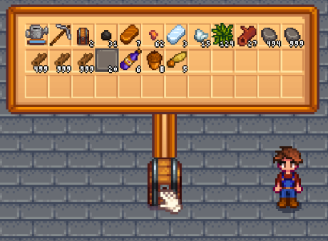

**You're viewing a file in the SMAPI mod dump, which contains a copy of every open-source SMAPI mod
for queries and analysis.**

**This is _not_ the original file, and not necessarily the latest version.**  
**Source repository: https://github.com/sergiomadd/StardewValleyMods**

----

# Chest Preview
Chest Preview provides a preview of a chest's items without opening the chest.  



## Requirements:
- Stardew Valley 1.5.6
- [SMAPI](https://smapi.io/)


## For Mod Authors (Compatibility):  

<details>
<summary>Custom Items:</summary>

Currently compatible with:
- [JsonAssets](https://www.nexusmods.com/stardewvalley/mods/1720)
- [Dynamic Game Assets](https://www.nexusmods.com/stardewvalley/mods/9365)  

If your mod adds custom items another way:
- If you add your item's sprite to the vanilla spritesheet, it should work. If not, please create a new issue with the details.
- If you DON'T add your item's sprite to the vanilla spritesheet, and use a custom way of loading the sprite, you have 2 options:  
  - Option 1: If you have an API with a way of checking if an Item is your custom type, then create an issue here or contact me so i can add your mod's items on my compatibility list.   
  - Option 2: Create a custom drawInPreview() method in your item class. The function MUST match this one (a copy of drawInMenu()):  
  `public void drawInPreview(SpriteBatch spriteBatch, Vector2 location, float scaleSize, float transparency, float layerDepth, StackDrawType drawStackNumber, Color color, bool drawShadow){}`  
    You can use [Chest Preview API](Framework/APIs/IChestPreviewAPI.cs)'s methods to check the current selected menu size.
    <details>
    <summary>DrawInPreview() example:</summary>
  
    From [ItemPipes](../ItemPipes/Framework/Items/PipeItem.cs#L155) 
    Probably, you will need to adjust: 
    - The sprite position
    - The stack numbers (tinyDigits) position
    - The quality star position
    ```c#
  
		public void drawInPreview(SpriteBatch spriteBatch, Vector2 location, float scaleSize, float transparency, float layerDepth, StackDrawType drawStackNumber, Color color, bool drawShadow)
		{
			IChestPreviewAPI api = ModEntry.ChestPreviewAPI;
			bool shouldDrawStackNumber = ((drawStackNumber == StackDrawType.Draw && this.maximumStackSize() > 1 && this.Stack > 1)
				|| drawStackNumber == StackDrawType.Draw_OneInclusive) && (double)scaleSize > 0.3 && this.Stack != int.MaxValue;
			Rectangle srcRect = new Rectangle(0, 0, 16, 16);
			int xOffSet = 0;
			int yOffSet = 0;
			int xOffSetDigit = 0;
			int yOffSetDigit = 0;
			int xOffSetQuality = 0;
			int yOffSetQuality = 0;
			//"Small"
			//String check also available 
			//api.GetPreviewSizeString().Equals("Small")
			if (api.GetPreviewSizeInt() == 0)
			{
				xOffSet = 10;
				yOffSet = 10;
				xOffSetDigit = -20;
				yOffSetDigit = -22;
				xOffSetQuality = 10;
				yOffSetQuality = -14;
			}
			//"Medium"
			//String check also available 
			//api.GetPreviewSizeString().Equals("Medium")
			else if (api.GetPreviewSizeInt() == 1)
			{
				xOffSet = 8;
				yOffSet = 8;
				xOffSetQuality = 12;
				yOffSetQuality = -8;
			}
			//"Big"
			//String check also available 
			//api.GetPreviewSizeString().Equals("Big")
			else if (api.GetPreviewSizeInt() == 2)
			{
				xOffSet = 8;
				yOffSet = 8;
				xOffSetDigit = -8;
				yOffSetDigit = -12;
				xOffSetQuality = 12;
				yOffSetQuality = -4;
			}
			//"Huge"
			//String check also available 
			//api.GetPreviewSizeString().Equals("Huge")
			else if (api.GetPreviewSizeInt() == 3)
			{
				xOffSet = 10;
				yOffSet = 10;
				xOffSetDigit = 0;
				yOffSetDigit = -2;
				xOffSetQuality = 12;
				yOffSetQuality = 2;
			}
			spriteBatch.Draw(ItemTexture, location + new Vector2((int)(32f * scaleSize) + xOffSet, (int)(32f * scaleSize) + yOffSet), srcRect, color * transparency, 0f,
				new Vector2(8f, 8f) * scaleSize, 4f * scaleSize, SpriteEffects.None, layerDepth);
			if (shouldDrawStackNumber)
			{
				var loc = location + new Vector2((float)
					(64 - Utility.getWidthOfTinyDigitString(this.Stack, 3f * scaleSize)) + 3f * scaleSize + xOffSetDigit,
					64f - 18f * scaleSize + 2f + yOffSetDigit);
				Utility.drawTinyDigits(this.Stack, spriteBatch, loc, 3f * scaleSize, 1f, color);
			}
			if (drawStackNumber != 0 && (int)quality > 0)
			{
				Microsoft.Xna.Framework.Rectangle quality_rect = (((int)quality < 4) ? new Microsoft.Xna.Framework.Rectangle(338 + ((int)quality - 1) * 8, 400, 8, 8) : new Microsoft.Xna.Framework.Rectangle(346, 392, 8, 8));
				Texture2D quality_sheet = Game1.mouseCursors;
				float yOffsetVanilla = (((int)quality < 4) ? 0f :
						(((float)Math.Cos((double)Game1.currentGameTime.TotalGameTime.Milliseconds * Math.PI / 512.0) + 1f) * 0.05f));
				spriteBatch.Draw(quality_sheet, location + new Vector2(12f + xOffSetQuality, 52f + yOffsetVanilla + yOffSetQuality),
					quality_rect, color * transparency, 0f,
					new Vector2(4f, 4f), 3f * scaleSize * (1f + yOffsetVanilla), SpriteEffects.None, layerDepth);
			}
		}
    ```  

    </details>
</details>

<details>
<summary>Custom Chests:</summary>
	
Compatible with:
- [Better Chests](https://www.nexusmods.com/stardewvalley/mods/9791)

Planned compatibility with:  
- [Expanded Storage](https://www.nexusmods.com/stardewvalley/mods/7431)
</details>


## See also
- [Read for translations](../translations.md)
- [Release Notes](docs/release-notes.md)
- [Nexus Mod Page](https://www.nexusmods.com/stardewvalley/mods/13946)
- [Contact](https://twitter.com/madded__)
