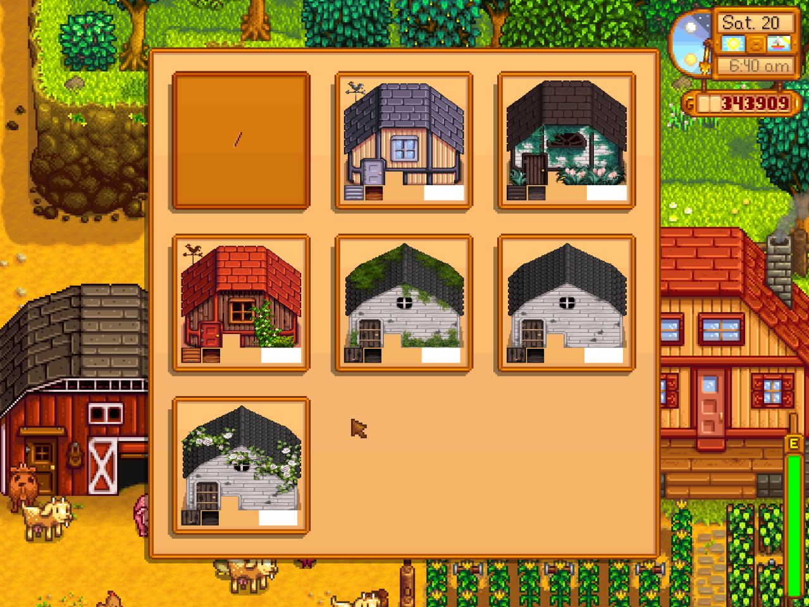

**You're viewing a file in the SMAPI mod dump, which contains a copy of every open-source SMAPI mod
for queries and analysis.**

**This is _not_ the original file, and not necessarily the latest version.**  
**Source repository: https://github.com/spacechase0/StardewValleyMods**

----

**Customize Exterior** is a [Stardew Valley](http://stardewvalley.net/) mod which lets you
customize the exterior of your buildings individually. This lets you have a different texture for
each instance of a building ([see example](screenshot-buildings.png)).



## Install
**This mod is deprecated. Consider using [Alternative Textures](https://smapi.io/mods/#Alternative_Textures)
instead.**

1. Install the latest version of...
   * [SMAPI](https://smapi.io);
   * and [SpaceCore](https://www.nexusmods.com/stardewvalley/mods/1348).
2. Install [this mod from Nexus Mods](http://www.nexusmods.com/stardewvalley/mods/1099).
3. Run the game using SMAPI.

## Use
### Adding textures
This mod has no built-in custom textures; you need to download the textures you want to use.

Customize Exterior will create a `Buildings` subfolder the first time you run it. You can install
any number of texture sets by putting each one in its own subfolder of `Buildings`. The name of
each file should match the building in your game's `Content/Buildings` folder. Each texture can be
a `.png` or `.xnb` file.

For example:

```
📁 Mods/
   📁 CustomizeExterior/
      📁 Buildings/
         📁 TextureSetA
            🗎 Shed.xnb
            🗎 houses.xnb
              ...
         📁 TextureSetB
            🗎 Shed.png
            🗎 houses.png
              ...
```

You can make textures seasonal by adding season folders within the texture set:

```
📁 Mods/
   📁 CustomizeExterior/
      📁 Buildings/
         📁 TextureSetA
            📁 spring/
               🗎 Shed.xnb
               🗎 houses.xnb
                 ...
            📁 summer/
               🗎 Shed.xnb
               🗎 houses.xnb
                 ...
            📁 fall/
               🗎 Shed.xnb
               🗎 houses.xnb
                 ...
            📁 winter/
               🗎 Shed.xnb
               🗎 houses.xnb
                 ...
```

### Applying textures in-game
Double right-click a building in-game to show the texture selection UI, and choose the texture to
apply.

### Textures in screenshot
For the texture sets shown in the screenshot, see:
* [Birch Building Mods](https://www.nexusmods.com/stardewvalley/mods/583)
* ~~[Medieval Modern Buildings](https://www.nexusmods.com/stardewvalley/mods/419)~~
* [Seasonal Vanilla](https://www.nexusmods.com/stardewvalley/mods/928)
* ~~[Victorian Era Buildings](https://www.nexusmods.com/stardewvalley/mods/682)~~
* ~~[Seasonal Victorian Buildings](https://www.nexusmods.com/stardewvalley/mods/891)~~

## Compatibility
Compatible with Stardew Valley 1.5+ on Linux/macOS/Windows, both single-player and multiplayer.

Compatible with [Map Image Exporter](https://www.nexusmods.com/stardewvalley/mods/1073). It also
supports textures made for [Seasonal Immersion](https://www.nexusmods.com/stardewvalley/mods/2273),
even without that mod installed.

## See also
* [Release notes](release-notes.md)
