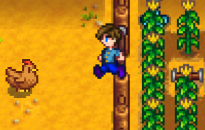

**You're viewing a file in the SMAPI mod dump, which contains a copy of every open-source SMAPI mod
for queries and analysis.**

**This is _not_ the original file, and not necessarily the latest version.**  
**Source repository: https://github.com/spacechase0/StardewValleyMods**

----

**Jump Over** is a [Stardew Valley](http://stardewvalley.net/) mod which lets you jump over things!

## Install
1. Install the latest version of [SMAPI](https://smapi.io).
2. Install [this mod from Nexus Mods](http://www.nexusmods.com/stardewvalley/mods/1844).
3. Run the game using SMAPI.

## Use
Press `Space` (configurable) to jump; do it while walking towards something (like a fence) to jump
over it.

## Compatibility
Compatible with Stardew Valley 1.5.5+ on Linux/macOS/Windows, both single-player and multiplayer.

## See also
* [Release notes](release-notes.md)
