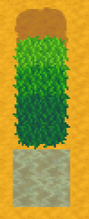

**You're viewing a file in the SMAPI mod dump, which contains a copy of every open-source SMAPI mod
for queries and analysis.**

**This is _not_ the original file, and not necessarily the latest version.**  
**Source repository: https://github.com/spacechase0/StardewValleyMods**

----

**Terraforming** is a [Stardew Valley](http://stardewvalley.net/) mod which lets you change maps
directly in-game.

## Install
This mod isn't released yet.

1. ~~Install the latest version of [SMAPI](https://smapi.io).~~
2. ~~Install this mod from Nexus Mods.~~
3. ~~Run the game using SMAPI.~~

## Use
Load your save, go to the area you want to terraform, and run the `terraform` command in the SMAPI
console to show the edit UI. Click the boxes on the sidebar to choose the tile type, then click on
the map tiles you want to replace. You can currently place two types of dirt, three types of grass,
and two types of water.

This is currently just an experiment. The map changes will be reset when you reload the save.

## Compatibility
Compatible with Stardew Valley 1.5+ on Linux/macOS/Windows, both single-player and multiplayer.

## See also
* [Release notes](release-notes.md)
