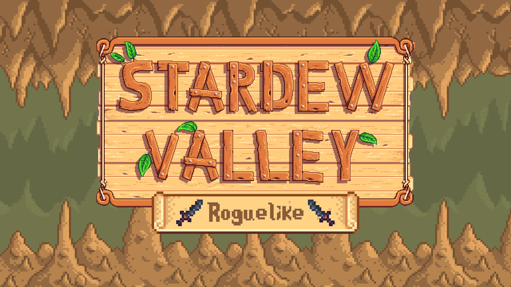

**You're viewing a file in the SMAPI mod dump, which contains a copy of every open-source SMAPI mod
for queries and analysis.**

**This is _not_ the original file, and not necessarily the latest version.**  
**Source repository: https://github.com/tylergibbs2/StardewValleyMods**

----

  

This is a mod for Stardew Valley which turns the game into a roguelike dungeon crawler.

Download the mod, view media, and get help on the [Nexus page](https://www.nexusmods.com/stardewvalley/mods/13614).

## Features

- 10 unique boss fights
- Custom floor layouts
- Floors with unique challenges
- Custom in-game perks and curses
- Online leaderboard system
- Difficulty scaling and hard mode
- Multiplayer support

## See also

* [Release notes](release-notes.md)
